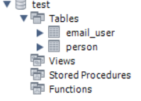

# ApiEmail
Email-Api

This project consists of making a registration for a Person and an emailUser and relating them through MySql.

When executing the application, the Person and Emai_User tables must be generated in the MySql workbench as follows:

There are specific get and put methods for PersonController and EmailUserControler:

There are general Post and Delete methods for EmailUserPersonController:

